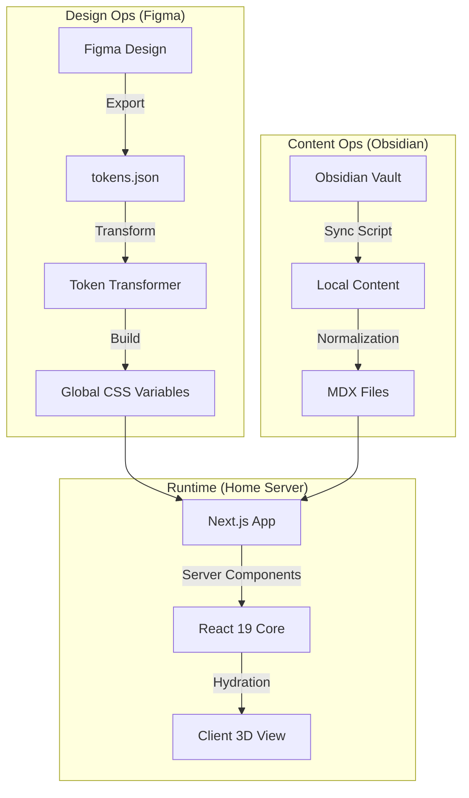
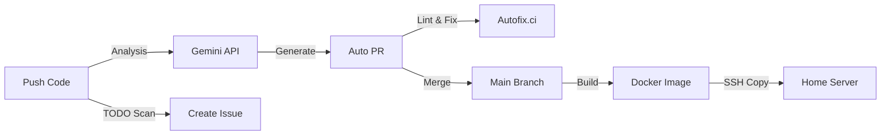

# ME

https://kimseungmin.dev

홈서버에서 Docker 컨테이너를 통해 직접 호스팅되고있는 개인 블로그입니다.

<!--

*3D Carousel Demo GIF*
-->

---

## 기술 스택
최신 기술을 적극적으로 도입하여 웹 퍼포먼스와 사용자 경험의 한계를 실험합니다.


-61DAFB?style=for-the-badge&logo=react&logoColor=black)


---

## 아키텍처 및 파이프라인
Obsidiand을 통한 로컬 저장소와 Figma, 홈서버를 연결하여 유기적으로 동작합니다.

### Data Flow: Knowledge -> Code


---

## DevOps & Automations
이 프로젝트는 수많은 봇과 스크립트에 의해 관리됩니다. 

| 자동화 | 도구 | 트리거 | 설명 |
| :--- | :--- | :--- | :--- |
| **AI PR Writer** | `auto-pr.yml` (Gemini) | `git push` | 코드 변경사항을 분석하여 PR 본문을 AI가 자동 작성합니다. |
| **Smart Commit** | `smart-commit.mjs` | `npm run commit` | 스테이징된 코드를 AI가 리뷰하고, 컨벤션에 맞는 커밋 메시지를 자동 생성합니다. |
| **Self Healing** | `autofix.yml` | Pull Request | 린트 에러나 스타일 문제를 자동으로 감지하고 수정합니다. |
| **Task Mgmt** | `todo-to-issue.yml` | `// TODO` | 코드 내의 `TODO` 주석을 감지하여 GitHub Issue로 자동 등록합니다. |
| **Figma Sync** | `transform-tokens.yml` | Token Push | 디자인 토큰이 업데이트되면 자동으로 CSS 변환 PR을 생성합니다. |
| **Home Deploy** | `ci-cd.yml` | Push to Main | Docker 빌드 후, SSH를 통해 **Home Server**로 배포됩니다. |

### CI/CD Pipeline Visualization


---

## 오픈소스 라이브러리
개발 과정에서 필요한 라이브러리를 직접 개발 및 배포했습니다.

### [`korean-markdown-fixer`](https://www.npmjs.com/package/korean-markdown-fixer)
> 마크다운에서 한글과 특수문자가 인접했을 때 볼드(`**`) 처리가 깨지는 문제를 해결하는 경량 유틸리티입니다.

- **Problem:** `**중요**합니다`는 잘 나오지만, `**'중요'**합니다`처럼 특수문자가 붙으면 파싱이 깨지는 현상 발생.
- **Solution:** 정규식을 이용해 렌더링에 필요한 공백 삽입.

---

## 기술적 결정

### 1. Next.js 16 & React 19
- **Why:** **React Server Components**를 활용하기 위함입니다.
- **Benefit:** 마크다운 파싱, 그래프 계산 등 무거운 로직을 서버로 격리하여 클라이언트 번들 사이즈를 최소화했습니다.

### 2. ESLint/Prettier 대신 Biome을 선택한 이유
- **Why:** 속도. Rust 기반의 압도적인 퍼포먼스 때문입니다.
- **Benefit:** 린팅과 포매팅이 밀리초 단위로 끝나며, 이는 `autofix` 워크플로우의 즉각적인 반응속도를 가능하게 합니다.

### 3. Tailwind CSS v4
- **Why:** 차세대 엔진(Oxide)을 미리 경험해보기 위함입니다.
- **Benefit:** 설정 파일(`tailwind.config.js`) 없이 CSS 우선의 구성을 실험하고 있습니다.

---

## 시작해보기

```bash
# 1. Clone
git clone https://github.com/sngminn/me.git

# 2. Install (pnpm 필수)
pnpm install

# 3. Env Setup
cp .env.example .env.local

# 4. Run
pnpm dev
```

### Script Commands
- `pnpm commit`: AI가 커밋 메시지를 작성해줍니다.
- `pnpm sync:assets`: Obsidian 볼트에서 데이터를 동기화합니다.
- `pnpm build:tokens`: Figma 토큰을 CSS 변수로 변환합니다.
