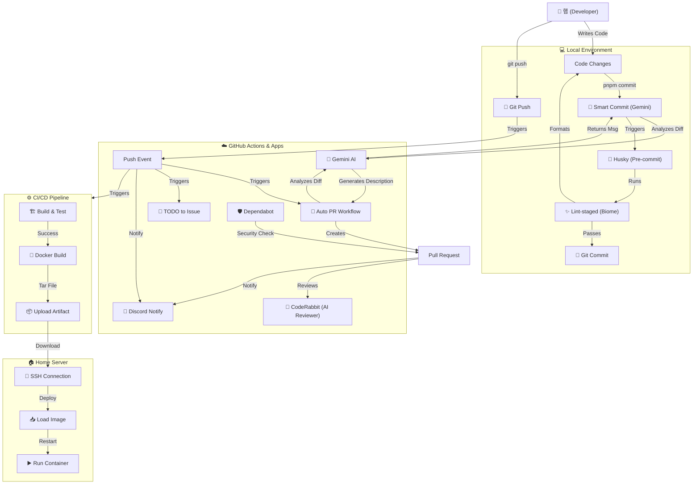

# 궁극의 자동화 시스템 (Ultimate Automation System)

**궁극의 자동화 시스템**은 **Zero-Touch Automation**을 지향하는 최첨단 DevOps 파이프라인입니다. AI와 현대적인 CI/CD의 강력함을 개발 워크플로우에 직접 불어넣습니다.

시스템에 대한 모든 것은 [심층 분석 문서](#-심층-분석-문서-deep-dive)에서 확인할 수 있습니다.

## 🚀 왜 궁극의 자동화인가? (Why Ultimate Automation?)

- 🎯 **Zero-Touch**: 코드 작성부터 배포까지 단 한 번의 푸시로 끝납니다. 수동 개입은 필요 없습니다.
- 🧠 **AI-Powered**: **Gemini 2.5**가 `git diff`를 분석하여 의미 있는 커밋 메시지와 상세한 Pull Request를 작성합니다.
- 🛡️ **Secure**: SSH 키 기반 인증과 격리된 Docker 컨테이너로 엔터프라이즈급 보안을 제공합니다.
- ⚡ **Fast**: **Next.js 15**, **React 19**, **Biome**를 기반으로 하여 빌드와 검사가 번개처럼 빠릅니다.
- 🔌 **Extensible**: 모듈화된 GitHub Actions 워크플로우로 쉽게 커스터마이징하고 확장할 수 있습니다.
- 💻 **Developer-First**: 시스템이 잡일을 처리하는 동안, 개발자는 오직 로직에만 집중할 수 있도록 설계되었습니다.

## 📦 설치 및 설정 (Installation & Setup)

### 필수 요구 사항 (Prerequisites)
- **Node.js**: 버전 20 이상
- **pnpm**: 버전 9 이상
- **Docker**: 로컬 컨테이너 테스트용 (선택 사항)

### 빠른 시작 (Quick Start)

#### 1. 클론 및 설치
```bash
git clone https://github.com/your-repo/me.git
cd me
pnpm install
```

#### 2. 환경 설정
로컬 AI 기능을 위해 `.env.local` 파일을 생성하세요:
```bash
GEMINI_API_KEY=your_api_key_here
```

#### 3. 로컬 실행
```bash
pnpm dev
```

## 📋 핵심 기능 (Key Features)

### 로컬 자동화 (Local Automation)
- **Smart Commit**: `pnpm commit`을 실행하면 AI가 커밋 메시지를 대신 작성해줍니다.
- **Husky & Lint-staged**: 모든 커밋 전에 코드를 자동으로 포맷팅하고 린트 검사를 수행합니다.

### GitHub 자동화 (GitHub Automation)
- **Auto PR**: 브랜치를 푸시하면 Gemini AI가 상세한 PR을 자동으로 생성합니다.
- **이슈 관리**: 코드 내의 `// TODO:` 주석이 자동으로 GitHub Issue로 변환됩니다.
- **CodeRabbit**: 모든 PR에 대해 AI가 코드 리뷰를 수행합니다.

### CI/CD 및 배포 (CI/CD & Deployment)
- **자동화된 테스트**: 모든 푸시마다 빌드와 체크가 실행됩니다.
- **Docker 패키징**: 최적화된 멀티 스테이지 빌드로 경량 아티팩트를 생성합니다.
- **홈서버 배포**: `main` 브랜치 병합 시 홈서버로 안전하게 SSH 배포됩니다.

## 🔐 인증 및 시크릿 (Authentication & Secrets)

전체 파이프라인을 활성화하려면 GitHub Actions에 다음 시크릿을 설정해야 합니다:

| 시크릿 이름 | 설명 |
| :--- | :--- |
| `GEMINI_API_KEY` | Google Gemini API 키 (PR 생성용) |
| `HOST` | 홈서버 IP 주소 또는 도메인 |
| `USERNAME` | 홈서버 SSH 사용자 이름 |
| `KEY` | 비밀번호 없는 접속을 위한 SSH 개인 키 |
| `DISCORD_WEBHOOK` | Discord 알림용 웹훅 URL |

## 🚀 시작하기 (Getting Started)

### 기본 사용법 (Basic Usage)

#### Smart Commit
`git commit` 대신 다음 명령어를 사용하세요:
```bash
pnpm commit
```
시스템이 변경 사항을 스테이징하고, diff를 분석하여 Conventional Commit 메시지를 생성합니다.

#### Auto PR 흐름
1. 새 브랜치 생성: `git checkout -b feature/amazing-feature`
2. 변경 사항 작업 및 커밋: `pnpm commit`
3. 원격 저장소로 푸시: `git push origin feature/amazing-feature`
4. **끝!** PR이 자동으로 생성되고, 리뷰가 달리고, 병합 준비가 완료됩니다.

## 📚 심층 분석 문서 (Deep Dive)

### 🔄 파이프라인 아키텍처 (Pipeline Architecture)



### 🤖 Smart Commit 내부 동작 (`scripts/smart-commit.mjs`)

`smart-commit` 스크립트는 로컬 git 환경과 Gemini AI를 연결하는 다리 역할을 합니다.

```javascript
// 커밋 메시지 생성을 위한 핵심 로직
async function generateCommitMessage(diff) {
  // ...
  const prompt = `
    당신은 숙련된 개발자입니다. 제공된 git diff를 바탕으로 Conventional Commits 규약(type: subject)을 따르는 간결하고 명확한 커밋 메시지를 생성하세요.
    // ... 규칙들 ...
  `;
  // ...
}
```
- **작동 원리**: `git diff --staged`를 캡처하여 특정 페르소나 프롬프트와 함께 Gemini 2.5 Flash Lite로 전송하고, 그 결과를 `git commit` 메시지로 사용합니다.

### 🔀 Auto PR 워크플로우 (`.github/workflows/auto-pr.yml`)

이 워크플로우는 사람의 노력 없이도 모든 푸시가 적절한 PR 설명을 갖도록 보장합니다.

```yaml
# .github/workflows/auto-pr.yml
jobs:
  auto-pr:
    steps:
      - name: Generate PR Content
        run: |
          bash .github/scripts/generate-pr-description.sh develop ${{ github.ref_name }}
```
- **로직**: `develop` 브랜치와 비교하여 현재 브랜치에서 정확히 무엇이 변경되었는지 병합 기준점(merge base)을 계산한 다음, Gemini에게 한국어로 요약을 요청합니다.

### 🐳 Docker 및 배포 전략 (Docker & Deployment Strategy)

우리는 단순함과 프라이버시를 위해 **레지스트리 없는(registry-less) 배포** 전략을 사용합니다.

**Dockerfile 최적화**:
```dockerfile
# Standalone 모드는 이미지 크기를 획기적으로 줄여줍니다
COPY --from=builder /app/.next/standalone ./
```

**배포 스크립트**:
```yaml
# .github/workflows/ci-cd.yml
script: |
  docker load -i me.tar
  docker stop me || true
  docker rm me || true
  docker run -d ... me:latest
```
- **프로세스**: Docker 이미지는 GitHub Actions에서 빌드되어 `.tar` 아티팩트로 저장되고, SCP를 통해 홈서버로 전송된 후 Docker에 직접 로드됩니다.

## 🤝 기여하기 (Contributing)

기여는 언제나 환영합니다! 다음 단계를 따라주세요:
1. 저장소를 포크합니다.
2. 기능 브랜치를 생성합니다.
3. 변경 사항을 커밋합니다 (`pnpm commit`을 사용하세요!).
4. 브랜치에 푸시합니다.
5. 나머지는 **Auto PR** 시스템이 알아서 처리합니다.

---

> **참고**: 이 문서는 자동으로 생성된... 농담입니다. 햄을 위해 사랑(과 AI)을 담아 작성했습니다.
