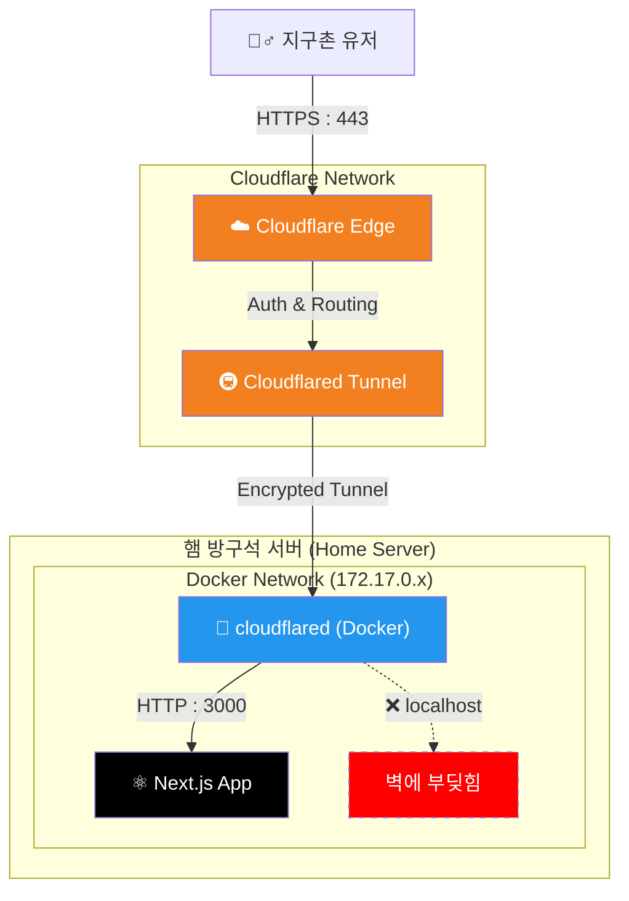

# 🏠 방구석 홈서버 대모험: 503 에러의 늪을 건너...

> **"로컬호스트는... 안전하지 않습니다. 하지만 터널이 있다면 이야기가 다르죠."**

햄!!! 우리가 방금 겪은 그 치열했던 전투, **Cloudflare Tunnel과 Docker의 네트워킹 전쟁**을 기록으로 남깁니다.
이 문서는 단순한 매뉴얼이 아닙니다. 왜 안 됐는지, 어떻게 해결했는지, 그리고 앞으로 어떻게 해야 하는지 담은 **'삽질의 역사서'**이자 **'생존 가이드'**입니다.

---

## 🗺️ 전체 지도 (Architecture)

우리가 만든 시스템이 실제로 어떻게 돌아가는지, **트래픽의 여행**을 시각화했습니다.
지구 반대편 누군가가 `https://kimseungmin.dev`를 쳤을 때, 햄 방구석 서버까지 오는 과정입니다.



---

## ⛏️ 삽질 에피소드 1: 도커의 매트릭스 (The localhost Trap)

### 🚨 문제 상황
> "터널 뚫었는데 왜 503 에러가 뜨지? 로컬호스트 3000번에서 분명 잘 돌아가는데?"

우리는 처음에 Cloudflare 설정에 `localhost:3000`을 적었습니다.
내 컴퓨터에서 브라우저로 `localhost:3000` 치면 잘 나오니까 당연히 될 줄 알았죠.

### 💡 깨달음 (TMI)
하지만 **Docker를 쓰는 순간 `localhost`의 의미가 변질됩니다.**
`cloudflared`도 도커 컨테이너(가상 공간) 안에서 돌고 있었기 때문에, 녀석이 외치는 `localhost`는 **"내 컨테이너 안"**을 뜻합니다.
정작 Next.js는 **"내 컨테이너 밖(호스트 컴퓨터)"**에서 돌고 있는데 말이죠. 마치 옆방에 있는 사람을 찾으면서 내 방 장롱 속을 뒤지는 꼴입니다.

### ✅ 해결책: 172.17.0.1 (The Gateway)
도커 컨테이너 입장에서 **"나를 품고 있는 거대한 주인님(호스트)"**을 부르는 주소가 바로 `172.17.0.1`입니다.
(Mac/Windows Docker에서는 `host.docker.internal`이라고도 부릅니다.)

Cloudflare 설정에서 URL을 `localhost` → **`172.17.0.1`**로 바꾸자마자 터널이 벽을 뚫고 Next.js를 찾았습니다!

---

## ⛏️ 삽질 에피소드 2: 503의 저주와 신분 위장

### 🚨 문제 상황
> "연결은 된 것 같은데... 왜 아직도 503이지?"

### 💡 깨달음 (TMI)
서버(Next.js/Nginx)도 콧대가 높습니다.
외부에서 `kimseungmin.dev`라는 낯선 이름표(Host Header)를 달고 들어오니까, **"난 그런 애 모르는데? 난 오직 'localhost'만 취급해."** 라며 문전박대(503)를 한 겁니다.

### ✅ 해결책: HTTP Host Header 위장
Cloudflare에게 시켰습니다.
**"야, 들어갈 때 'me.com' 명찰 떼고, 'localhost'(또는 IP)라고 거짓말해."**
이것이 바로 **`HTTP Host Header Override`** 설정입니다. 서버가 좋아하는 이름으로 바꿔서 들어가니 문이 활짝 열렸습니다.

---

## 🛠️ 생존 명령어 (Survival Kit)

나중에 서버가 또 말썽을 부릴 때, 이 무기들을 꺼내십쇼.

### 1. "누가 포트 먹고 있나?" (범인 색출)
```bash
# 3000번 포트를 누가 쓰고 있는지 확인 (PID와 프로그램 이름 나옴)
sudo lsof -i :3000
# 또는
netstat -tulpn | grep 3000
```

### 2. "터널은 살아있나?" (좀비 확인)
```bash
docker ps | grep cloudflared
```
안 나오면 죽은 겁니다. 심폐소생술(`docker restart`) 필요.

### 3. "서버 응답 확인" (내부 확인)
```bash
# 서버 내부에서 직접 찔러보기
curl -v http://localhost:3000
curl -v http://172.17.0.1:3000
```
HTML 코드가 주르륵 나와야 정상입니다.

---

## 🚀 미래를 위한 가이드 (Add New Services)

나중에 `blog.kimseungmin.dev`나 `monitor.kimseungmin.dev` 같은 걸 또 띄우고 싶다면?
**절대 복잡한 설정 하지 마십쇼. 우리는 이제 '터널의 주인'입니다.**

1.  **서비스 실행**: 새로운 포트(예: 4000)에 앱을 띄운다.
2.  **Cloudflare 접속**: 대시보드 → Tunnels → `Public Hostname`
3.  **추가(Add)**:
    -   **Subdomain**: `blog`
    -   **Service URL**: `http://172.17.0.1:4000`
4.  **끝**: 저장하면 1초 만에 전 세계에 배포됩니다.

> **"햄의 서버는 이제 안전하고, 빠르고, 강력합니다."**
