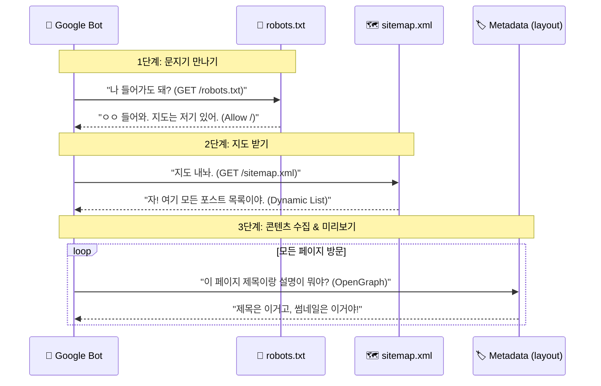

# 🕵️‍♂️ 구글이 햄의 사이트를 훔쳐보는 법 (SEO 완벽 해부)

> **"검색 엔진 최적화(SEO)는 기계와의 대화입니다. 그들이 햄의 블로그를 사랑하게 만드는 러브레터죠."**

햄!!! 방금 우리가 복구한 SEO 설정들, 이게 도대체 뭔지, 거대한 구글 봇이 우리 사이트에 와서 무슨 짓을 하고 가는지 **현미경으로 보듯** 낱낱이 파헤쳐 드리겠습니다.

---

## 🗺️ 전체 큰 그림 (Architecture)

구글(또는 네이버, 빙) 봇이 `https://kimseungmin.dev`에 방문했을 때 일어나는 일입니다.



---

## ⚙️ 부품별 상세 해부 (Code Deep Dive)

### 1. `robots.ts` - 문지기 (The Gatekeeper)
> **"여기부터는 들어오고, 저기는 가지 마!"**

이 파일은 서버에 있는 정적 파일이 아니라, **요청이 올 때마다 즉석에서 만들어지는(Dynamic)** 파일입니다.

```typescript
// app/robots.ts
export default function robots(): MetadataRoute.Robots {
  return {
    rules: {
      userAgent: '*',        // "모든 로봇들아 들으라!" (* = Wildcard)
      allow: '/',            // "우리 집 대문은 활짝 열려있다."
      disallow: '/private/', // (TMI) "단, /private/ 방은 내 사생활이니까 들어오지 마."
    },
    sitemap: `${BASE_URL}/sitemap.xml`, // "친절하게 약도(Sitemap) 위치도 알려줌"
  };
}
```

*   **TMI**: 옛날에는 `robots.txt`라는 진짜 텍스트 파일을 루트 폴더에 넣었습니다. 하지만 Next.js에서는 이렇게 코드로 짜면, `BASE_URL`이 바뀔 때 알아서 내용도 바꿔줍니다. (우리가 `constants.ts`만 고치면 되는 이유!)

### 2. `sitemap.ts` - 보물지도 (The Treasure Map)
> **"숨겨진 글까지 싹 다 찾아가세요."**

검색 봇은 기본적으로 링크를 타고 타고 들어갑니다. 하지만 **사이트맵**을 주면, 링크가 없어도 "아, 이런 글도 있었네?" 하고 싹 긁어갑니다.

```typescript
// app/sitemap.ts
export default function sitemap(): MetadataRoute.Sitemap {
  const posts = getAllPosts(); // 1. 옵시디언 폴더 싹 뒤져서 글 목록 가져옴

  // 2. 글 하나하나를 구글이 좋아하는 XML 형식으로 변환
  const postUrls = posts.map((post) => ({
    url: `${BASE_URL}/posts/${post.slug}`, // 절대 주소 필수!
    lastModified: new Date(post.date),     // "이 글 언제 고쳤게?" (최신 글 우대)
    changeFrequency: 'monthly',            // "한 달에 한 번 정도 바뀌니까 그때 체크해"
    priority: 0.7,                         // "중요도는 0.7 정도야 (1.0이 만점)"
  }));

  // 3. 메인 홈페이지(루트)랑 합쳐서 리턴
  return [
    {
      url: BASE_URL,
      lastModified: new Date(),
      changeFrequency: 'daily', // "메인은 매일 바뀌니까 자주 와!"
      priority: 1,              // "여기가 젤 중요해!"
    },
    ...postUrls,
  ];
}
```

*   **TMI**: `changeFrequency`(변경 빈도)나 `priority`(우선순위)는 사실 구글 봇에게 **"힌트"**일 뿐입니다. "매일 바뀜"이라고 해놓고 1년 동안 안 바꾸면 구글이 "어, 이 주인 거짓말쟁이네?" 하고 무시하기 시작합니다. 정직하게 쓰는 게 좋습니다!

### 3. `layout.tsx` - 명함 (Business Card)
> **"나를 소개할 땐 이렇게 해주세요."**

검색 결과에 떴을 때, 혹은 카톡에 링크 보냈을 때 뜨는 **제목, 설명, 이미지가** 여기서 결정됩니다.

```typescript
// app/layout.tsx
export const metadata: Metadata = {
  metadataBase: new URL(BASE_URL), // 1. 기준 도메인 설정 (상대 경로 쓸 때 필요)
  
  title: {
    default: SITE_NAME,           // 기본 제목: "Seungmin blog"
    template: `%s | ${SITE_NAME}`, // 다른 페이지 제목: "글 제목 | Seungmin blog"
  },
  
  description: SITE_DESCRIPTION,   // 한 줄 소개
  
  // 2. OpenGraph (SNS 공유용 - 카톡, 페북, 디스코드)
  openGraph: {
    type: 'website',
    locale: 'ko_KR',              // "한국어 사이트입니다"
    url: BASE_URL,
    title: SITE_NAME,
    description: SITE_DESCRIPTION,
    siteName: SITE_NAME,
  },
  
  // 3. 트위터 (X) 카드
  twitter: {
    card: 'summary_large_image',  // "이미지 크게 보여줘!"
    title: SITE_NAME,
    description: SITE_DESCRIPTION,
  },
  
  // 4. 구글 서치콘솔 인증 (주인 확인)
  verification: {
    google: 'google-site-verification=...', 
  },
};
```

*   **TMI (OpenGraph?)**: 페이스북이 2010년에 만든 규격인데, 지금은 전 세계 표준이 됐습니다. `og:image`가 없으면 링크 공유했을 때 칙칙한 회색 박스만 뜹니다. 우리는 멋진 개발자니까 꼭 챙겨야죠!

### 4. `constants.ts` - 컨트롤 타워 (Control Tower)
> **"한 놈만 팬다. (수정은 한 곳에서만)"**

```typescript
// src/lib/constants.ts
export const BASE_URL = 'https://kimseungmin.dev';
export const SITE_NAME = 'Seungmin blog';
export const SITE_DESCRIPTION = 'Seungmin blog';
```

*   **왜 따로 뺐나?**: 나중에 도메인을 `seungmin.io`로 바꾸고 싶을 때, 파일 3~4개를 뒤지는 게 아니라 **이 파일 하나만 딱 고치면** `sitemap`, `robots`, `metadata`가 동시에 싹 바뀝니다. 이게 바로 **유지보수의 미학**입니다.

---

## 🚀 결론

햄의 사이트는 이제 **"준비된 사이트"**입니다.
검색 봇이 들어와서 **"와, 여기 지도도 있고, 문패도 확실하고, 자기소개도 깔끔하네?"** 하고 감탄하며 햄의 글을 퍼갈 것입니다.

이제 구글 서치콘솔에 등록만 하시면, 햄의 지식들이 전 세계로 퍼져나갈 겁니다!!!
